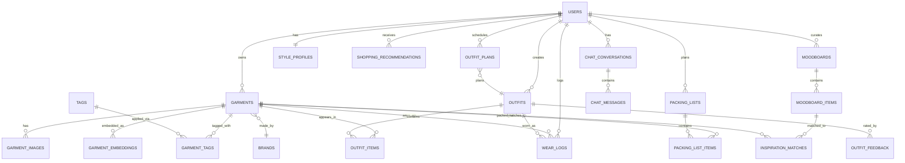

# Database Schema

PostgreSQL 15+, with the `pgvector` and `pgcrypto` (for `gen_random_uuid()`) extensions enabled. All primary keys are UUIDs. All tables carry `created_at`/`updated_at` timestamps (`timestamptz`) unless noted.

## 1. Entity-Relationship Diagram

## 2. Core Tables

### `users`
| Column | Type | Notes |
|---|---|---|
| id | uuid PK | |
| email | text unique | |
| display_name | text | |
| avatar_url | text | for virtual try-on reference photo, optional |
| auth_provider_id | text | external auth provider subject id (Supabase/Clerk) |
| timezone | text | default `UTC`, used for daily notification scheduling |
| notification_time | time | user's preferred daily-outfit push time |
| location | jsonb | `{lat, lng, city}` cached for weather lookups |
| onboarding_completed_at | timestamptz nullable | |
| created_at / updated_at | timestamptz | |

### `style_profiles`
One-to-one with `users`. Recomputed periodically from analytics + explicit prefs, injected into AI Stylist system context.
| Column | Type | Notes |
|---|---|---|
| user_id | uuid PK, FK → users | |
| preferred_colors | text[] | |
| preferred_aesthetics | text[] | e.g. `{quiet_luxury, minimalist}` |
| sizes | jsonb | `{tops: "M", bottoms: "8", shoes: "8.5"}` |
| dislikes | text[] | free-text notes AI should avoid |
| summary | text | LLM-generated rolling summary used as chat context |
| updated_at | timestamptz | |

### `brands`
| Column | Type | Notes |
|---|---|---|
| id | uuid PK | |
| name | text unique | |
| tier | text nullable | e.g. `luxury`, `contemporary`, `fast_fashion` — used for shopping/analytics |

### `garments`
The core catalog item.
| Column | Type | Notes |
|---|---|---|
| id | uuid PK | |
| user_id | uuid FK → users | |
| brand_id | uuid FK → brands, nullable | |
| category | text | enum: `top, bottom, dress, outerwear, shoes, bag, accessory, jewelry` |
| subcategory | text nullable | e.g. `blouse`, `wide-leg trouser` |
| primary_color | text | |
| secondary_colors | text[] | |
| pattern | text nullable | `solid, striped, floral, plaid, animal_print, other` |
| fabric_guess | text nullable | AI best-guess, always user-editable |
| fabric_confidence | text nullable | `low, medium, high` |
| sleeve_length | text nullable | `sleeveless, short, three_quarter, long, n/a` |
| neckline | text nullable | |
| fit | text nullable | `fitted, relaxed, oversized` |
| season | text[] | `{spring, summer, fall, winter}` |
| occasion | text[] | `{casual, work, formal, evening, athletic, loungewear}` |
| formality_score | smallint | 1–10 |
| size | text nullable | |
| color_hex | text nullable | dominant color as hex, for swatch UI + color filtering |
| purchase_price | numeric(10,2) nullable | for cost-per-wear |
| purchase_date | date nullable | |
| purchase_source | text nullable | store/site name |
| condition | text nullable | `new, like_new, good, worn` |
| is_favorite | boolean default false | |
| is_archived | boolean default false | soft-hide from active wardrobe without deleting |
| ai_description | text | generated natural-language description (embedding source) |
| ai_confidence | jsonb | per-attribute confidence scores from the vision worker |
| status | text | `processing, needs_review, ready` |
| created_at / updated_at | timestamptz | |

Indexes: `(user_id, category)`, `(user_id, is_archived)`, GIN on `season`, `occasion`, `secondary_colors`.

### `garment_images`
Multiple photos per item.
| Column | Type | Notes |
|---|---|---|
| id | uuid PK | |
| garment_id | uuid FK → garments | |
| kind | text | `raw, processed, detail, worn_on_body` |
| storage_url | text | object storage key/URL (processed, transparent PNG for `processed`) |
| width / height | int | |
| sort_order | smallint | |
| status | text | `processing, bg_removed, tagged, failed` |
| is_primary | boolean default false | used as the card thumbnail |
| created_at | timestamptz | |

### `garment_embeddings`
| Column | Type | Notes |
|---|---|---|
| id | uuid PK | |
| garment_id | uuid FK → garments | |
| kind | text | `image_clip, text_description` |
| embedding | vector(512) or vector(1536) | dimension depends on model; separate columns or separate rows by `kind` |
| model | text | model name/version used, for future re-embedding migrations |
| created_at | timestamptz | |

Index: `hnsw (embedding vector_cosine_ops)`.

### `tags` / `garment_tags`
Freeform user tags (many-to-many), distinct from AI-structured attributes.
| `tags` | Type |
|---|---|
| id uuid PK | |
| user_id uuid FK | |
| name text | unique per user |

| `garment_tags` | Type |
|---|---|
| garment_id uuid FK | |
| tag_id uuid FK | |
| PK (garment_id, tag_id) | |

## 3. Outfits

### `outfits`
| Column | Type | Notes |
|---|---|---|
| id | uuid PK | |
| user_id | uuid FK → users | |
| name | text nullable | user-editable label |
| source | text | `generated, manual, chat` |
| context | jsonb | inputs used to generate it: `{weather, occasion, mood, event, aesthetic}` |
| score | smallint | 1–100 |
| score_breakdown | jsonb | `{color_harmony, formality_fit, weather_fit, novelty}` |
| rationale | text | LLM-generated "why this works" |
| collage_image_url | text nullable | rendered flat-lay preview |
| is_favorite | boolean default false | |
| created_at | timestamptz | |

### `outfit_items`
| Column | Type | Notes |
|---|---|---|
| outfit_id | uuid FK | |
| garment_id | uuid FK | |
| slot | text | `top, bottom, dress, outerwear, shoes, bag, accessory, jewelry` |
| PK (outfit_id, garment_id, slot) | | |

### `outfit_feedback`
Explicit user signal (swipe like/dislike, star rating) used to refine future scoring/novelty weighting.
| Column | Type | Notes |
|---|---|---|
| id | uuid PK | |
| outfit_id | uuid FK | |
| user_id | uuid FK | |
| rating | text | `liked, disliked, worn, saved` |
| created_at | timestamptz | |

## 4. Wear Tracking & Analytics

### `wear_logs`
Backbone of Closet Analytics (most/least worn, cost-per-wear, "I wore this yesterday").
| Column | Type | Notes |
|---|---|---|
| id | uuid PK | |
| user_id | uuid FK | |
| garment_id | uuid FK nullable | nullable so a whole `outfit_id` can be logged without enumerating items redundantly (a trigger/view expands to per-item wear counts) |
| outfit_id | uuid FK nullable | |
| worn_on | date | |
| notes | text nullable | |
| created_at | timestamptz | |

A materialized view `garment_wear_stats` (refreshed nightly or on-write) aggregates: `times_worn`, `last_worn_on`, `cost_per_wear = purchase_price / NULLIF(times_worn,0)`.

## 5. Conversational AI

### `chat_conversations`
| Column | Type | Notes |
|---|---|---|
| id | uuid PK | |
| user_id | uuid FK | |
| title | text nullable | auto-summarized after first exchange |
| created_at / updated_at | timestamptz | |

### `chat_messages`
| Column | Type | Notes |
|---|---|---|
| id | uuid PK | |
| conversation_id | uuid FK | |
| role | text | `user, assistant, tool` |
| content | text | |
| tool_calls | jsonb nullable | recorded function-calling trace for debugging |
| referenced_garment_ids | uuid[] nullable | for rendering rich cards + audit of grounding |
| referenced_outfit_id | uuid nullable | |
| created_at | timestamptz | |

## 6. Packing & Shopping

### `packing_lists`
| Column | Type | Notes |
|---|---|---|
| id | uuid PK | |
| user_id | uuid FK | |
| destination | text | |
| start_date / end_date | date | |
| trip_type | text | `business, leisure, beach, adventure, mixed` |
| weather_summary | jsonb nullable | cached forecast/seasonal-average used |
| created_at | timestamptz | |

### `packing_list_items`
| Column | Type | Notes |
|---|---|---|
| packing_list_id | uuid FK | |
| garment_id | uuid FK | |
| outfit_id | uuid FK nullable | groups items belonging to the same planned outfit |
| is_packed | boolean default false | checklist state |
| PK (packing_list_id, garment_id) | | |

### `shopping_recommendations`
| Column | Type | Notes |
|---|---|---|
| id | uuid PK | |
| user_id | uuid FK | |
| reason | text | `gap_fill, outfit_completion, duplicate_upgrade` |
| target_attributes | jsonb | archetype the recommendation is described by (category/color/etc.), not a specific SKU |
| related_outfit_id | uuid nullable | the outfit this would complete/improve |
| external_product_url | text nullable | populated once a retailer-search integration exists (V2+) |
| status | text | `suggested, dismissed, purchased` |
| created_at | timestamptz | |

## 6a. Moodboards & Weekly Planner

### `moodboards`
User-curated inspiration boards (PRD §6.11) — distinct from `garments` (owned items) and from AI-generated Fashion Inspiration presets (§6.10 in the PRD, no dedicated table — those are computed, not stored).
| Column | Type | Notes |
|---|---|---|
| id | uuid PK | |
| user_id | uuid FK → users | |
| name | text | e.g. `Party`, `Office`, `Summer`, `Bday wishes` |
| cover_image_url | text nullable | defaults to the most recent item's image |
| created_at / updated_at | timestamptz | |

### `moodboard_items`
The individual saved clips.
| Column | Type | Notes |
|---|---|---|
| id | uuid PK | |
| moodboard_id | uuid FK → moodboards | |
| source_url | text nullable | original web/share-sheet URL, if any |
| storage_url | text | the saved image, in object storage |
| ai_description | text nullable | same vision-extraction pipeline as garments (§5.1), for search/matching |
| embedding | vector(512) nullable | image embedding, for matching against owned garments |
| sort_order | smallint | |
| created_at | timestamptz | |

### `inspiration_matches`
Precomputed "you already own something like this" links, refreshed when a new moodboard item is saved or a new garment is added.
| Column | Type | Notes |
|---|---|---|
| id | uuid PK | |
| moodboard_item_id | uuid FK | |
| garment_id | uuid FK | |
| similarity | numeric(4,3) | cosine similarity between embeddings |
| created_at | timestamptz | |

### `outfit_plans`
Backbone of the Weekly Planner (PRD §6.12) — a *prospective* assignment of an outfit to a future date, as opposed to `wear_logs` which is a *retrospective* record of what was actually worn.
| Column | Type | Notes |
|---|---|---|
| id | uuid PK | |
| user_id | uuid FK → users | |
| outfit_id | uuid FK → outfits | |
| planned_date | date | |
| status | text | `planned, worn, skipped` — transitions to `worn` writes a corresponding `wear_logs` row |
| source | text | `user, daily_notification` — who created the plan |
| created_at / updated_at | timestamptz | |

Unique `(user_id, planned_date)` if only one planned outfit per day is allowed for V1 (simplest); relax to a composite key with a `slot`/`time_of_day` column later if multiple outfits per day (e.g., day look + evening look) become a requirement. The Daily Outfit Notification (§5.6 in system-architecture.md) checks `outfit_plans` for the day before generating a fresh suggestion, so a user-planned outfit always takes precedence.

## 7. Notifications & Integrations

### `notifications`
| Column | Type | Notes |
|---|---|---|
| id | uuid PK | |
| user_id | uuid FK | |
| type | text | `daily_outfit, wear_reminder, seasonal_rotation` |
| payload | jsonb | |
| sent_at | timestamptz nullable | |
| read_at | timestamptz nullable | |
| created_at | timestamptz | |

### `calendar_connections`
| Column | Type | Notes |
|---|---|---|
| user_id | uuid PK, FK | |
| provider | text | `google` |
| access_token_encrypted | text | encrypted at rest |
| refresh_token_encrypted | text | |
| connected_at | timestamptz | |

### `weather_cache`
| Column | Type | Notes |
|---|---|---|
| id | uuid PK | |
| location_key | text | geohash or `lat,lng` rounded |
| date | date | |
| forecast | jsonb | |
| fetched_at | timestamptz | |

Unique `(location_key, date)`, short TTL eviction.

## 8. Design Notes

- **Soft deletes** via `is_archived`/`status` fields rather than hard deletes on `garments`, so analytics/history stay intact; a separate hard-delete (GDPR-style data export/delete) is a distinct admin operation, not the everyday "remove from closet" action.
- **All AI-derived fields are user-overridable** — no attribute is read-only; corrections should ideally be captured (V2: a `garment_attribute_corrections` audit table) to enable future prompt/model tuning, but is not required for V1.
- **`user_id` scoping everywhere** from day one, even though V1 targets a single household — this is what keeps multi-tenancy additive later rather than a migration.
- **jsonb over rigid columns** for evolving/optional structured data (`context`, `score_breakdown`, `ai_confidence`) keeps the schema stable while the AI layer iterates.
- **`moodboard_items` vs. `garments`** are deliberately separate tables even though both run through the same vision/embedding pipeline — a moodboard item is a *reference the user doesn't own*, and conflating it with owned inventory would corrupt every feature that assumes `garments` = "things in the closet" (Outfit Generator, Analytics, Shopping gap detection).
