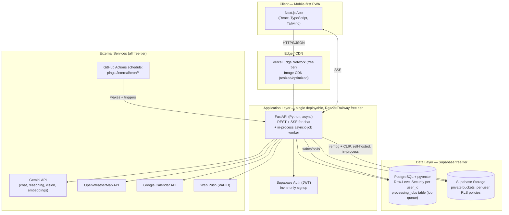
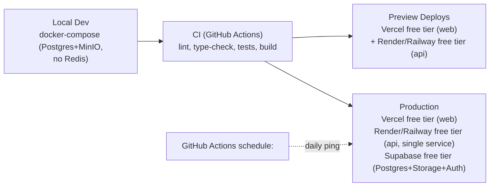
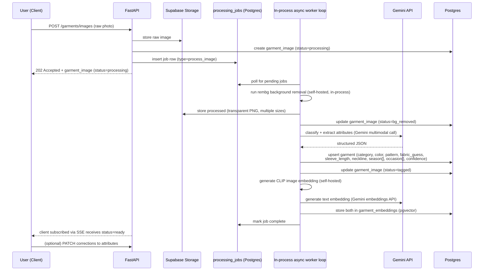
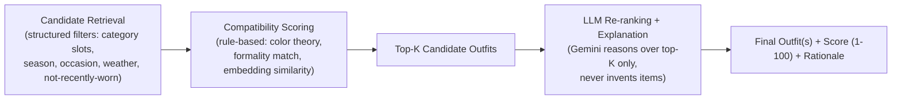
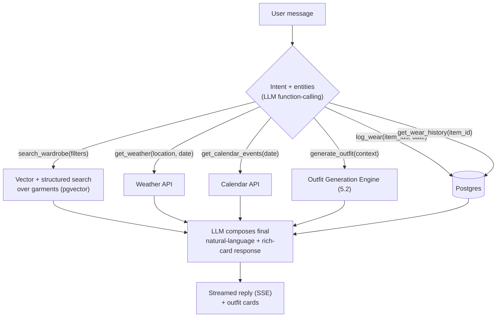

# System Architecture

> Built to a hard **$0 budget** against a locked stack (Next.js PWA / FastAPI / Supabase / Gemini free tier / self-hosted `rembg`) — see [tech-stack-justification.md](../tech-stack-justification.md) for the full reasoning. This is multi-user (invite-only, per-user data isolation via Postgres RLS — see §6), not single-household.

## 1. High-Level Overview



## 2. Component Responsibilities

| Component | Responsibility | Why here |
|---|---|---|
| **Next.js Web (PWA)** | All UI, camera capture, offline caching, push subscription | Mobile-first, installable on iPhone/iPad via Add to Home Screen, single codebase, SSR for fast first paint |
| **FastAPI (single service)** | Auth-gated REST API, orchestration, sync business logic (scoring, filtering), SSE stream for stylist chat, **and** the in-process async job worker (bg removal, vision tagging, embeddings) | Async-native, typed via Pydantic, auto OpenAPI docs; one deployable keeps the whole backend inside one free-tier instance — see §3 |
| **`processing_jobs` table (Postgres)** | Queue for slow AI work, polled by an in-process `asyncio` loop instead of Redis | Decouples upload response from processing without a second paid-adjacent service (no free managed Redis on Render/Railway) |
| **Background removal (`rembg`/U2Net)** | Runs self-hosted, in-process, on raw uploads | No per-image cost, CPU-tolerant; skipped entirely for sensitive-category items (§6) |
| **Vision attribute extraction (Gemini)** | Multimodal call to classify category/attributes and produce a structured JSON + natural-language description | Zero-shot, no training data needed, free-tier compatible; skipped entirely for sensitive-category items |
| **Embeddings (CLIP self-hosted + Gemini text embeddings)** | Image embedding (CLIP) and text embedding (Gemini) per item, stored in `pgvector` | Powers semantic search, outfit-matching similarity, duplicate detection — no separate embeddings bill |
| **Postgres + pgvector (Supabase)** | System of record for all structured data, vector search, **and** row-level security enforcement per user | One free database serves relational + vector + the multi-tenant isolation boundary |
| **Supabase Storage** | Raw + processed images, at multiple derived sizes, in private per-user-scoped buckets | Bundled with the DB/Auth vendor at $0; never stored in Postgres itself |
| **GitHub Actions `schedule:` workflow** | Pings internal cron endpoints for daily outfit notification, wear reminders, seasonal-rotation nudges | Free, wakes a sleeping free-tier instance and triggers the job — no dedicated scheduler service needed |

## 3. Why a modular monolith, single deployable, for V1

FastAPI ships as **one deployable service** with clearly separated internal modules (routers/services/repositories per domain — see [folder-structure.md](./folder-structure.md)). Unlike a typical AI-pipeline architecture, there is deliberately **no separate worker service**: AI/image processing runs as an in-process `asyncio` background loop within the same FastAPI process, polling the `processing_jobs` table. This is a budget decision, not just a simplicity one — a second always-on service doesn't fit inside a $0, free-tier-only hosting plan. This gives:

- Fast iteration speed for a solo build, and a single free-tier instance to operate.
- A natural internal seam (routers/services vs. job handlers) that already matches the real scaling axis, so if usage ever outgrows one process, job handling can be pulled into a real worker + queue behind the same `processing_jobs` interface without an application rewrite — just an infra change.
- Domain logic isolated in service classes, not scattered through route handlers, so both the API and the in-process job loop call the same `GarmentService`/`OutfitService` methods.

## 4. Environments & Deployment Topology



- **Frontend:** Vercel free tier (native Next.js hosting, edge CDN, image optimization, preview URLs per PR).
- **API (+ in-process jobs):** Render or Railway free tier, **one service**. Known tradeoff accepted explicitly: the free tier spins down on inactivity and cold-starts on the next request/cron ping — not treated as a bug to eliminate, just a documented UX cost of staying at $0.
- **Database + Storage + Auth:** Supabase free tier — Postgres (with `pgvector` and Row-Level Security enforcing per-user isolation), Storage (private buckets, per-user access policies), and Auth (invite-only signup — no public registration route) all in one vendor.
- **Scheduled jobs:** GitHub Actions `schedule:` cron (already free for this repo's CI) hits `/internal/cron/*` endpoints — covers daily notifications, wear reminders, seasonal-rotation nudges without a paid scheduler.
- **Observability:** Sentry free tier (errors, both frontend and backend) + PostHog free tier (product analytics — funnel from upload → tagged → worn); watch both against their free-tier event caps as usage grows past a handful of users.

## 5. AI Architecture (Detailed)

### 5.1 Ingestion Pipeline (photo → catalogued item)

Applies to standard items only. **Sensitive-category items (§6) skip this entire pipeline** — no `rembg`, no Gemini call, manual entry instead.



**Why an LLM/VLM instead of a custom-trained CNN for classification:**
A bespoke fashion classifier (e.g., fine-tuned on DeepFashion2) would need labeled training data and MLOps investment that isn't justified at this scale, and would still need somewhere to host it. Gemini does zero-shot structured extraction with a well-designed JSON-schema prompt, at $0 on the free tier for the request volumes a handful of users generates. The architecture keeps this worker abstracted behind an interface (`AttributeExtractor`) so it can be swapped later (a fine-tuned model, a different provider) without touching any other layer.

**Attribute extraction prompt contract** (structured output / function calling), conceptually:
```json
{
  "category": "top | bottom | dress | outerwear | shoes | bag | accessory | jewelry",
  "subcategory": "e.g. blouse, wide-leg trouser, trench coat",
  "primary_color": "string (named color)",
  "secondary_colors": ["string"],
  "pattern": "solid | striped | floral | plaid | animal-print | other",
  "fabric_guess": "string, confidence: low|medium|high",
  "sleeve_length": "sleeveless | short | 3/4 | long | n/a",
  "neckline": "string | n/a",
  "fit": "fitted | relaxed | oversized | n/a",
  "season": ["spring", "summer", "fall", "winter"],
  "occasion": ["casual", "work", "formal", "evening", "athletic", "loungewear"],
  "formality_score": "1-10",
  "description": "one-sentence natural language description for embeddings/search"
}
```

### 5.2 Outfit Generation Engine (hybrid rules + LLM)

Pure LLM generation hallucinates plausibility without grounding in *actual* owned items and struggles with numeric consistency (scores). Pure rules-engines can't produce the natural "why this works" explanation. So the engine is a **hybrid**:



1. **Candidate retrieval:** deterministic SQL/vector query pulls eligible items per slot (top/bottom-or-dress/outerwear/shoes/bag/accessories), filtered by hard constraints (season, weather match, occasion, "not worn in last N days" unless explicitly requested).
2. **Compatibility scoring (rule engine):** deterministic, explainable, cheap —
   - Color harmony (complementary/analogous/monochrome/neutral-anchor rules against a color-wheel model).
   - Formality consistency across slots.
   - Season/weather fit.
   - Novelty bonus for rarely-worn items (drives closet rediscovery, a named PRD goal).
3. **LLM re-ranking & explanation:** only the top ~10 rule-scored combinations are sent to the LLM (keeps cost bounded and prevents hallucinated items — the LLM picks/orders among *given* candidates and writes the rationale, it does not invent new combinations from scratch).
4. **Score normalization:** final 1–100 score = weighted blend of rule-score and LLM-assigned qualitative score, so scores stay consistent and explainable rather than an opaque LLM number.

### 5.3 AI Stylist (RAG + tool-calling chat)



- Implemented as an LLM tool-use loop (Gemini function calling), with a small fixed toolset (see above) — this is what lets "I have a job interview" resolve to `generate_outfit(occasion=formal-interview)` and "show me pink outfits" resolve to `search_wardrobe(color=pink)` reliably, instead of free-text guessing.
- Conversation memory: last N turns + a per-user "style profile" summary (preferred colors, sizing notes, aesthetic leanings) injected as system context, refreshed periodically from Closet Analytics rather than recomputed every message.
- Grounding rule: the assistant is only allowed to reference items returned by `search_wardrobe`/`generate_outfit` — never free-associates clothing that isn't in the database (prevents hallucinated wardrobe items).

#### 5.3.1 Stylist Persona (USP candidate #1, selected — PRD §10.1)

The tool-use mechanics above are what make the Stylist *work*; the persona is what makes it feel different from a generic chatbot bolted onto a wardrobe app. Implementation is almost entirely a system-prompt and product-copy concern, not new infrastructure:

- **A fixed voice, not a configurable one.** One consistent persona (warm, direct, a little playful, opinionated without being pushy — closer to a trusted friend who happens to have great taste than a customer-service bot) defined once in a versioned system prompt (`ai/prompts/stylist_persona.md`), not exposed as a user-configurable "tone" setting — the point is a considered point of view, not a blank slate.
- **Opinions over options.** Where a generic assistant hedges ("here are 5 outfits, you decide"), the persona leads with a top pick and *says why*, then offers alternatives — mirrors the rationale-first pattern already in the Outfit Generator (§5.2) rather than introducing a new behavior.
- **Voice input/output (optional, additive).** Speech-to-text on the chat input (native browser `SpeechRecognition`/Whisper API) and optional text-to-speech on replies — off by default, toggled in Settings — reusing the existing SSE text stream as the source for TTS rather than a parallel pipeline.
- **No schema or privacy impact.** Persona is prompt-layer only; conversation storage (`chat_conversations`/`chat_messages`) is unchanged from §5.3's design above.

### 5.4 Embeddings & Semantic Search

- **Image embeddings:** CLIP, self-hosted (no per-call cost) over the background-removed image → used for "similar items," duplicate detection, and visual outfit-coherence scoring.
- **Text embeddings:** Gemini embeddings API (free tier) over the generated natural-language description + structured attributes → used for the stylist chat's semantic search ("something flowy for a beach dinner").
- Both stored in the same Postgres instance via `pgvector` (`vector(512)`/`vector(768)` columns, dimension per model), with an `hnsw` index. This is sufficient through tens of thousands of items; if/when the app opens to many more users than the invite-only handful it targets today, this table is the one component with a documented lift-out path to a dedicated vector DB since it's read through a single `EmbeddingStore` interface, not queried ad hoc.
- Sensitive-category items (§6) never generate embeddings from an externally-sent image, since they're never sent to Gemini and typically have no AI-processed photo at all — they're excluded from embedding-based search/matching by construction, not by an extra filter.

### 5.5 Virtual Try-On (V3)

- MVP substitute (V1/V2): 2D flat-lay collage compositing already-background-removed item images on a canvas (cheap, instant, on-brand with the "Clueless closet" reference).
- V3 real try-on: diffusion-based garment-transfer model — **must stay a self-hosted open-source model** (e.g. OOTDiffusion, IDM-VTON) under the $0 constraint, since hosted try-on APIs are paid. This means it needs a free (or free-trial) GPU-capable host at V3 time, which is an open question deliberately deferred rather than solved now — flagged in the roadmap as the highest-cost, highest-complexity, most budget-sensitive feature, last for a reason.

### 5.6 Cost & Rate-Limit Controls (Gemini free tier)

- Bulk/background work (attribute tagging) uses Gemini's cheapest/fastest model tier; interactive chat can use a stronger tier — both configurable per environment, but both must stay within free-tier availability, not just "cheaper."
- Aggressive caching: identical outfit-generation requests (same date/weather/occasion, no new items) reuse cached results for the day.
- Attribute extraction and embeddings are computed **once per image** and persisted — never recomputed on read.
- Outbound Gemini calls are serialized/rate-limited inside `AIClient` (see [api-architecture.md](./api-architecture.md)) so a burst — e.g. batch-uploading dozens of items during onboarding — spreads out within free-tier per-minute/per-day caps instead of erroring, at the cost of slower processing under burst load. Acceptable trade-off for a household-scale user base with no paid fallback tier.
- All external AI calls go through the `AIClient` abstraction so provider/model can change via config, and so usage against the free-tier quota can be logged/monitored centrally — this is the first thing to watch as more family members get invited.

## 6. Multi-User Isolation, Consent & Sensitive Content

This is an **invite-only multi-user product**, not a single-household app — the developer, girlfriend, sister, and possibly a few more family members each get a fully isolated account. See [database-schema.md](./database-schema.md) for the concrete tables/policies; this section is the architectural summary.

- **Isolation is enforced at the database layer, not just in application code.** Every user-scoped table carries `user_id` and has Postgres Row-Level Security enabled with a policy keyed to `auth.uid()`. Critically, FastAPI does **not** connect to Postgres using the Supabase `service_role` key for normal user-facing queries — that key bypasses RLS by design and would silently defeat the whole point. Instead, each authenticated request's Postgres session has the user's identity set as a transaction-local claim (`request.jwt.claim.sub`) so RLS policies apply the same way they would through Supabase's own client libraries. A bug in a `WHERE user_id = ...` clause somewhere in the app is not enough to leak another user's data — the database itself refuses the row.
- **Signup is invite-only.** No public registration route. The developer creates or approves each account (via an `invites` table + Supabase Auth), and onboarding is gated behind a T&C + consent screen (§below) before a new account reaches the wardrobe.
- **Storage isolation is explicit, not assumed.** Supabase Storage buckets are created private, with per-user path-scoped policies on `storage.objects` (`auth.uid()` must match the owning folder). Verifying this (not relying on default bucket settings) is a documented Phase 0 setup step — a misconfigured public bucket is one of the most common and most serious mistakes at this stage.
- **Developer photo-access consent.** A per-user `consent_dev_photo_access` boolean (default **on**, pre-checked) lives on the same onboarding screen as the T&C, not routed around it. When set, the developer may receive a copy of uploaded photos for debugging; this is app-level plumbing (a flagged export/notification path), not a bypass of RLS.
- **Sensitive-category items get a stricter path that overrides consent, not the other way around.** Items flagged `sensitive_category` (auto-set for underwear/lingerie/similar, user-togglable): never go through §5.1's pipeline (no `rembg`, no Gemini call — full manual entry: text description + quantity, photo optional); if a photo is stored at all, it's excluded from outfit-generation candidate retrieval, any shared/social view, and the dev-photo-access pipeline **regardless of that user's `consent_dev_photo_access` setting**. This is a hard exclusion, not a default.
- **Third-party AI data-use disclosure.** Per Google's Gemini API Additional Terms of Service, free-tier submissions may be used to improve Google's models and may be read by human reviewers (§5.6/tech-stack-justification.md have the sourced detail). Onboarding discloses this plainly. Underwear/lingerie photos specifically are requested not to be uploaded at all, since automated filtering isn't reliable enough at free-tier vision-model quality to enforce this in code — it's a disclosed policy, not a technical guarantee.
