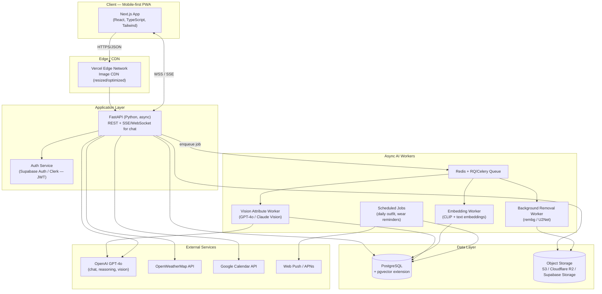
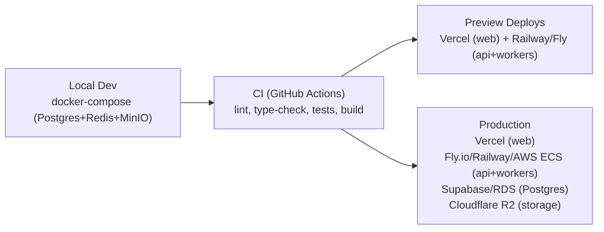
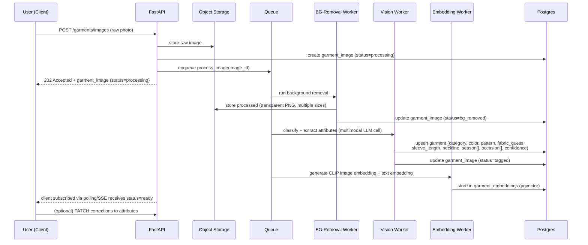
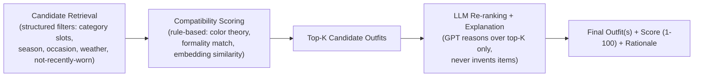
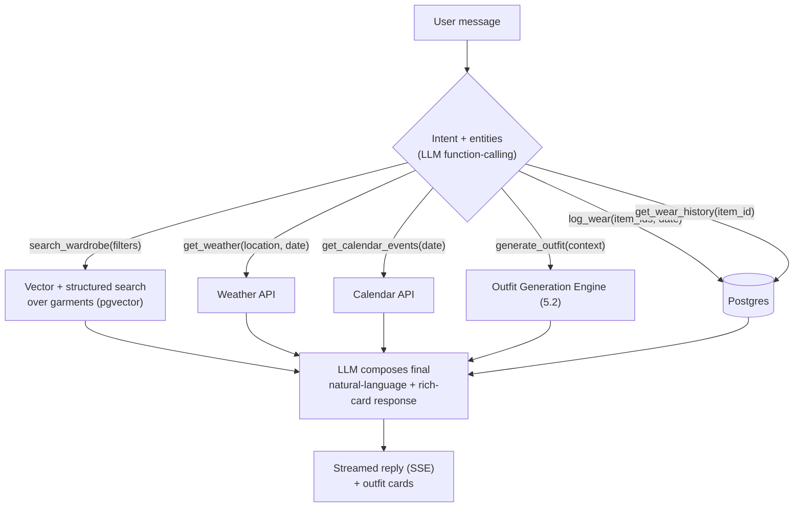

# System Architecture

## 1. High-Level Overview



## 2. Component Responsibilities

| Component | Responsibility | Why here |
|---|---|---|
| **Next.js Web (PWA)** | All UI, camera capture, offline caching, push subscription | Mobile-first, installable, single codebase, SSR for fast first paint |
| **FastAPI** | Auth-gated REST API, orchestration, sync business logic (scoring, filtering), SSE stream for stylist chat | Async-native, typed via Pydantic, auto OpenAPI docs, great Python↔AI ecosystem fit |
| **Redis + Queue (RQ/Celery)** | Decouples slow AI work (bg removal, vision tagging, embeddings) from the request/response cycle | Uploads must feel instant; processing happens async with client polling/subscribing for status |
| **Background Removal Worker** | Runs `rembg`/U2Net (self-hosted, GPU or CPU) on raw uploads | Cheap at scale vs. calling a paid API per image; can swap to a hosted API later without touching the schema |
| **Vision Attribute Worker** | Calls a multimodal LLM to classify category/attributes and produce a structured JSON + a natural-language description | Zero-shot, no training data needed, good enough accuracy for a personal wardrobe scale (hundreds, not millions, of items) |
| **Embedding Worker** | Produces an image embedding (CLIP) and/or text embedding (from the generated description) per item, stored in `pgvector` | Powers semantic search ("show me something like this"), outfit-matching similarity, and duplicate detection |
| **Postgres + pgvector** | System of record for all structured data *and* vector search | One database for MVP scale (thousands of items) avoids operating a second vector DB; index type `ivfflat`/`hnsw` scales well past this size |
| **Object Storage (S3/R2)** | Raw + processed images, at multiple derived sizes | Durable, cheap, CDN-friendly; never stored in Postgres |
| **Scheduled Jobs** | Daily outfit notification, wear-log reminders, seasonal rotation nudges | Cron-triggered background jobs, same worker fleet |

## 3. Why a modular monolith (not microservices) for V1

FastAPI ships as **one deployable service** with clearly separated internal modules (routers/services/repositories per domain — see [folder-structure.md](./folder-structure.md)), plus **one separate worker service** for AI/image processing (which has different scaling needs — CPU/GPU-bound, bursty). This gives:

- Fast iteration speed for a small team/solo build.
- A natural seam (API vs. workers) that already matches the real scaling axis (request latency vs. batch compute).
- A clear extraction path: if/when a specific domain (e.g., outfit-generation) needs independent scaling, it peels off into its own service without a rewrite, because domain logic is already isolated in service classes, not scattered through route handlers.

## 4. Environments & Deployment Topology



- **Frontend:** Vercel (native Next.js hosting, edge CDN, image optimization, preview URLs per PR).
- **API + Workers:** Fly.io or Railway for V1 (simple, cheap, container-based, easy Redis/Postgres add-ons); documented upgrade path to AWS ECS Fargate + SQS if usage grows beyond a single household.
- **Database:** Supabase Postgres (managed, includes pgvector, storage, and auth in one vendor — reduces ops burden for a small build) or AWS RDS if avoiding vendor lock-in is prioritized.
- **Observability:** Sentry (errors, both frontend and backend), PostHog (product analytics — funnel from upload → tagged → worn), structured logging (JSON) shipped to a log drain (Logtail/Axiom).

## 5. AI Architecture (Detailed)

### 5.1 Ingestion Pipeline (photo → catalogued item)



**Why an LLM/VLM instead of a custom-trained CNN for classification:**
A bespoke fashion classifier (e.g., fine-tuned on DeepFashion2) would need labeled training data and MLOps investment that isn't justified at "one wardrobe" scale. A frontier multimodal model (GPT-4o or Claude with vision) does zero-shot structured extraction with a well-designed JSON-schema prompt, at a per-image cost that's trivial for a few hundred to a few thousand items. The architecture keeps this worker abstracted behind an interface (`AttributeExtractor`) so it can be swapped for a fine-tuned model later purely for cost reasons, without touching any other layer.

**Attribute extraction prompt contract** (structured output / function calling), conceptually:
```json
{
  "category": "top | bottom | dress | outerwear | shoes | bag | accessory | jewelry",
  "subcategory": "e.g. blouse, wide-leg trouser, trench coat",
  "primary_color": "string (named color)",
  "secondary_colors": ["string"],
  "pattern": "solid | striped | floral | plaid | animal-print | other",
  "fabric_guess": "string, confidence: low|medium|high",
  "sleeve_length": "sleeveless | short | 3/4 | long | n/a",
  "neckline": "string | n/a",
  "fit": "fitted | relaxed | oversized | n/a",
  "season": ["spring", "summer", "fall", "winter"],
  "occasion": ["casual", "work", "formal", "evening", "athletic", "loungewear"],
  "formality_score": "1-10",
  "description": "one-sentence natural language description for embeddings/search"
}
```

### 5.2 Outfit Generation Engine (hybrid rules + LLM)

Pure LLM generation hallucinates plausibility without grounding in *actual* owned items and struggles with numeric consistency (scores). Pure rules-engines can't produce the natural "why this works" explanation. So the engine is a **hybrid**:



1. **Candidate retrieval:** deterministic SQL/vector query pulls eligible items per slot (top/bottom-or-dress/outerwear/shoes/bag/accessories), filtered by hard constraints (season, weather match, occasion, "not worn in last N days" unless explicitly requested).
2. **Compatibility scoring (rule engine):** deterministic, explainable, cheap —
   - Color harmony (complementary/analogous/monochrome/neutral-anchor rules against a color-wheel model).
   - Formality consistency across slots.
   - Season/weather fit.
   - Novelty bonus for rarely-worn items (drives closet rediscovery, a named PRD goal).
3. **LLM re-ranking & explanation:** only the top ~10 rule-scored combinations are sent to the LLM (keeps cost bounded and prevents hallucinated items — the LLM picks/orders among *given* candidates and writes the rationale, it does not invent new combinations from scratch).
4. **Score normalization:** final 1–100 score = weighted blend of rule-score and LLM-assigned qualitative score, so scores stay consistent and explainable rather than an opaque LLM number.

### 5.3 AI Stylist (RAG + tool-calling chat)



- Implemented as an LLM tool-use loop (OpenAI function calling), with a small fixed toolset (see above) — this is what lets "I have a job interview" resolve to `generate_outfit(occasion=formal-interview)` and "show me pink outfits" resolve to `search_wardrobe(color=pink)` reliably, instead of free-text guessing.
- Conversation memory: last N turns + a per-user "style profile" summary (preferred colors, sizing notes, aesthetic leanings) injected as system context, refreshed periodically from Closet Analytics rather than recomputed every message.
- Grounding rule: the assistant is only allowed to reference items returned by `search_wardrobe`/`generate_outfit` — never free-associates clothing that isn't in the database (prevents hallucinated wardrobe items).

### 5.4 Embeddings & Semantic Search

- **Image embeddings:** CLIP (or a hosted multimodal embedding endpoint) over the background-removed image → used for "similar items," duplicate detection, and visual outfit-coherence scoring.
- **Text embeddings:** OpenAI `text-embedding-3-small` over the generated natural-language description + structured attributes → used for the stylist chat's semantic search ("something flowy for a beach dinner").
- Both stored in the same Postgres instance via `pgvector` (`vector(512)`/`vector(1536)` columns), with an `hnsw` index. This is sufficient through tens of thousands of items; if/when the app opens to many households, this table is the one component with a documented lift-out path to a dedicated vector DB (Pinecone/Weaviate/Qdrant) since it's read through a single `EmbeddingStore` interface, not queried ad hoc.

### 5.5 Virtual Try-On (V3)

- MVP substitute (V1/V2): 2D flat-lay collage compositing already-background-removed item images on a canvas (cheap, instant, on-brand with the "Clueless closet" reference).
- V3 real try-on: diffusion-based garment-transfer model (open-source options: OOTDiffusion, IDM-VTON; hosted options exist too) run as its own GPU-backed worker, given a user reference photo/avatar + the outfit's item images. Flagged in the roadmap as the highest-cost, highest-complexity feature — deliberately last.

### 5.6 Cost & Latency Controls

- Bulk/background work (attribute tagging) uses a cheaper/faster model tier; interactive chat uses a stronger reasoning model — both configurable per environment.
- Aggressive caching: identical outfit-generation requests (same date/weather/occasion, no new items) reuse cached results for the day.
- Attribute extraction and embeddings are computed **once per image** and persisted — never recomputed on read.
- All external AI calls go through a thin `AIClient` abstraction (see [api-architecture.md](./api-architecture.md)) so provider/model can change via config, and so usage/cost can be logged centrally.
