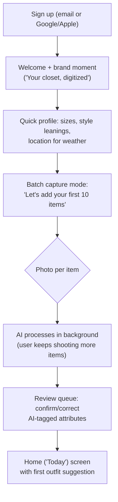
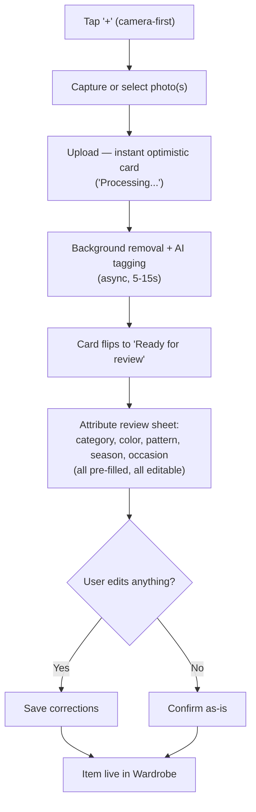
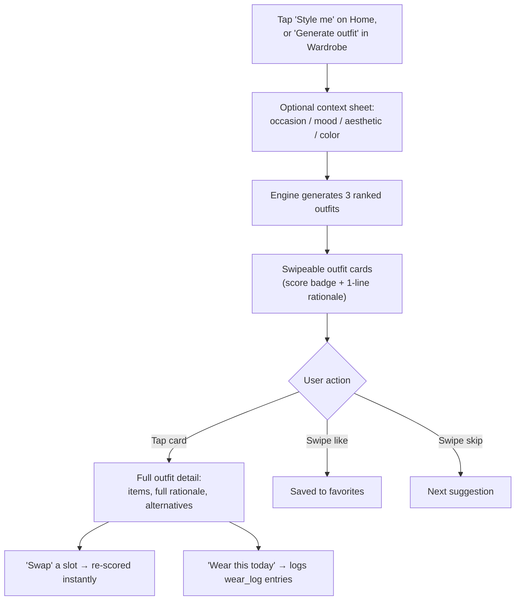
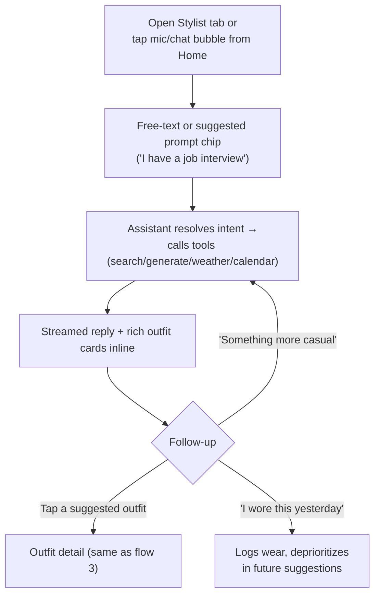
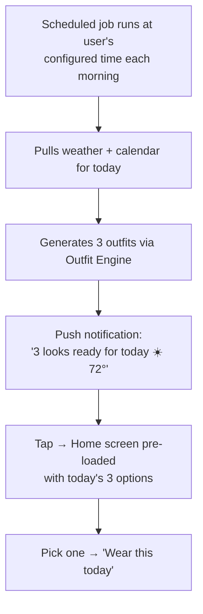
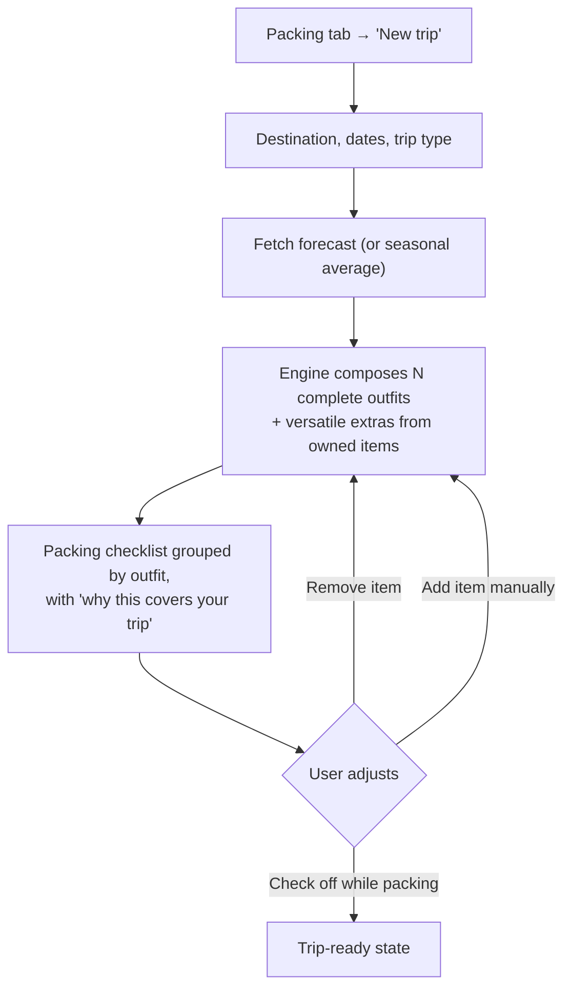
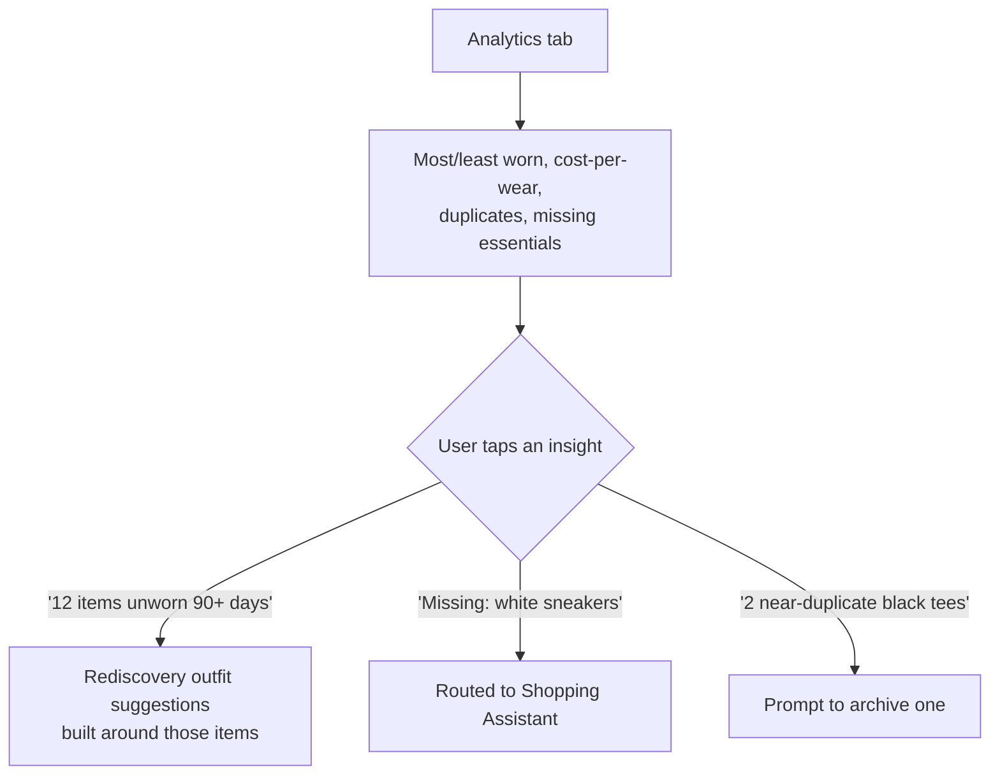
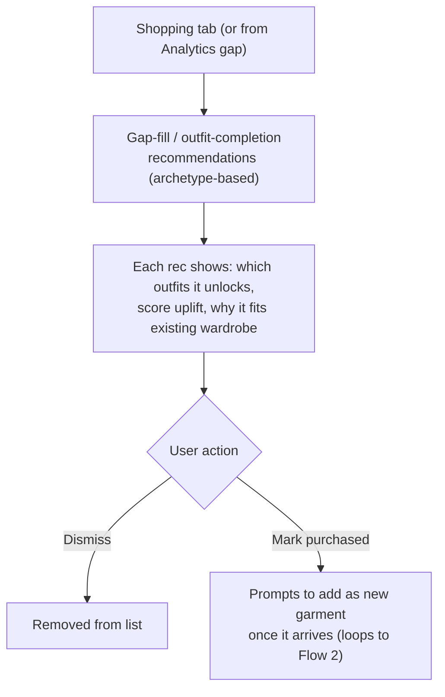
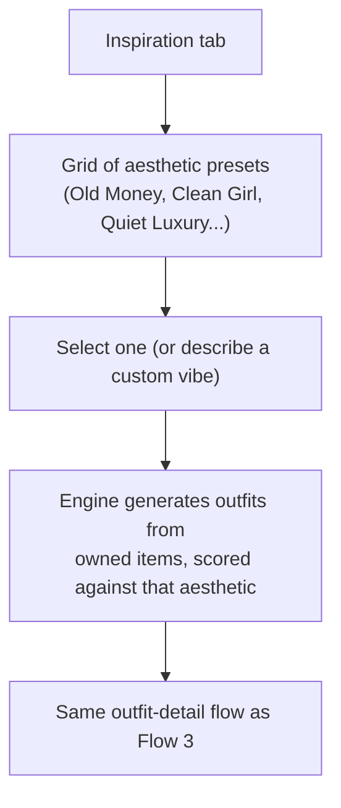

# User Flows

## 1. Onboarding

Design intent: get to a *usable* wardrobe (10–20 items) inside the first session without making the user wait on each photo — capture is decoupled from processing.

## 2. Add a Garment (core loop, used constantly)

## 3. Outfit Generation (manual, from Wardrobe or Home)

## 4. AI Stylist Chat

## 5. Daily Outfit Notification

## 6. Packing Assistant

## 7. Closet Analytics → Action

## 8. Shopping Assistant

## 9. Fashion Inspiration

